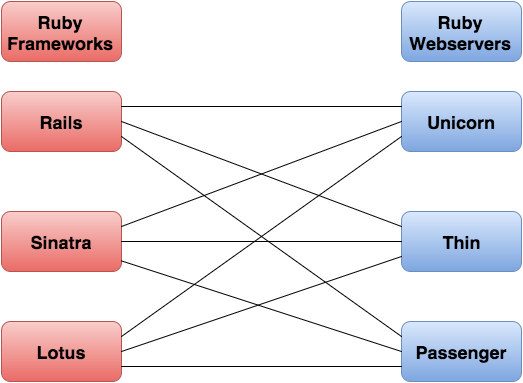
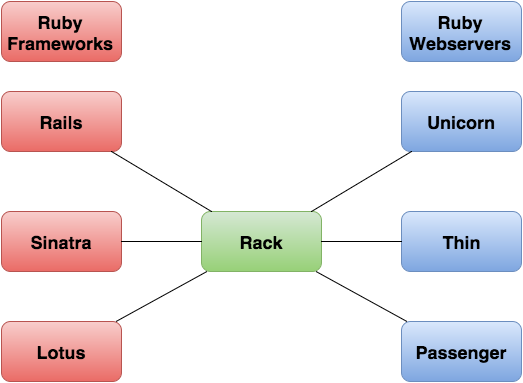
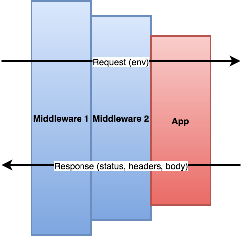

# Rack apps and middleware

## What is Rack?

* Number 2 most downloaded gem on rubygems.org
* A spec for code that responds to HTTP:
    1. Object that responds to `call`
    2. Takes one argument (`env`)
    3. Returns `[status, headers, body]` where `body` responds to `each`

## Why Rack?

* Universal adapter
    * Original design
    * Only useful for framework/webserver designers

### Without Rack

### With Rack

### Other uses
* Good model for HTTP requests
* Middleware

## Basic Rack app

* [Class](intro_rack_apps/hello_world.rb) or [proc](intro_rack_apps/proc.rb)
  based.
* `env` is a big hash of stuff from the request. See [app the outputs its
  `env`](intro_rack_apps/env.rb) and [list of keys](intro_rack_apps/rack_env_keys.rb) in
  such an env

## Middleware

* Sits between the user and the app
* Can intercept requests/responses and modify them
* Can be chained together

Example middleware (logs time):

* [App](middleware/app.rb)
* [Logger middleware](middleware/middleware_logger.rb)
* [Runner](middleware/run.rb)

## Rack::Builder

* Shortcut to all the nesting
* `use` for Middleware (classes)
* `run` for apps (instance)
* run via the command-line with `rackup`

Example middleware (logs time):

* [App](builder/app.rb)
* [Logger middleware](builder/middleware_logger.rb)
* [Rackup file](builder/config.ru)

## Rails on Rack

* Rails apps are rack apps (see `config.ru`)
* Rails has middleware (see `rake middleware`)
* Cookies, sessions, and params are handled by middleware
* Routes can point to any Rack app (or stack)

## In the wild

* [`Rack::Attack`](https://github.com/kickstarter/rack-attack) (rate limiting)
* [`Rack::Honeypot`](https://github.com/sunlightlabs/rack-honeypot) (spam trap)
